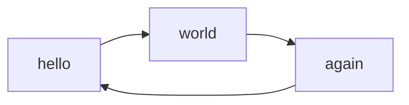

## access-control

[To Pipeline](https://qa.harness.io/ng/account/px7xd_BFRCi-pfWPYXVjvw/module/ci/orgs/default/projects/Shivam/pipelines/P1RemoteTemplate/pipeline-studio?repoName=testrepo&connectorRef=GithubConnector&storeType=REMOTE)

